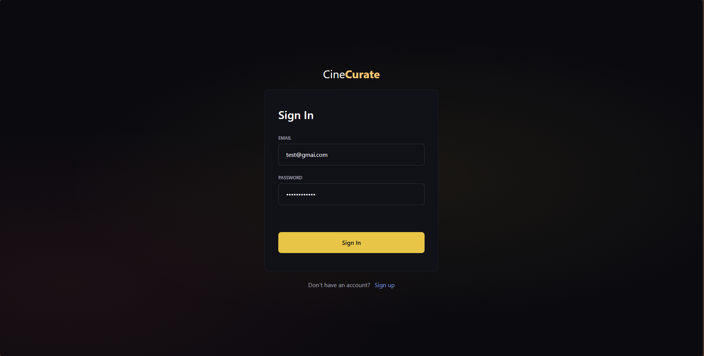
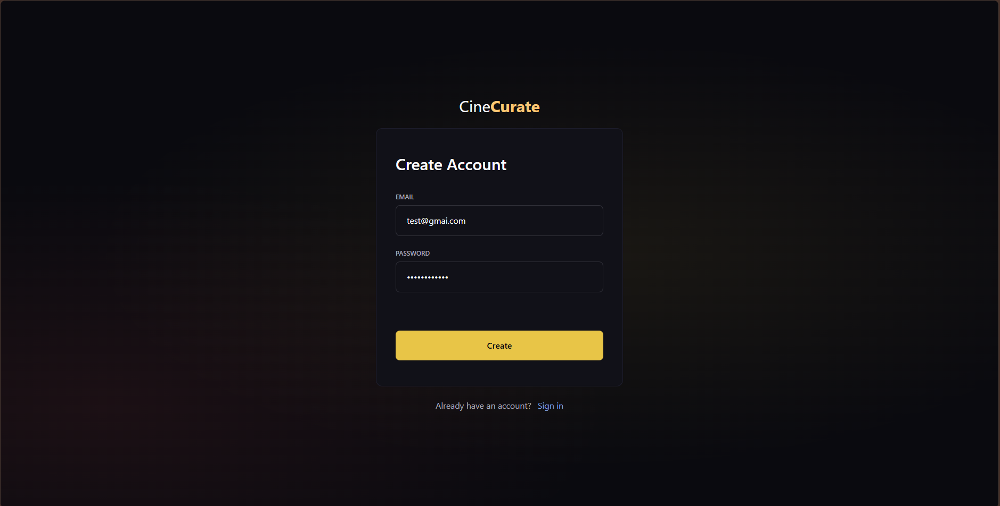
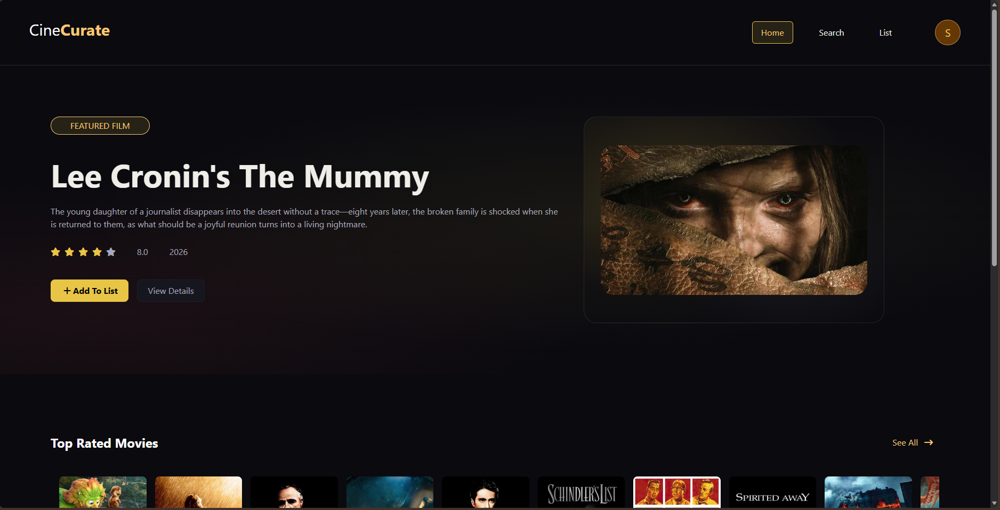
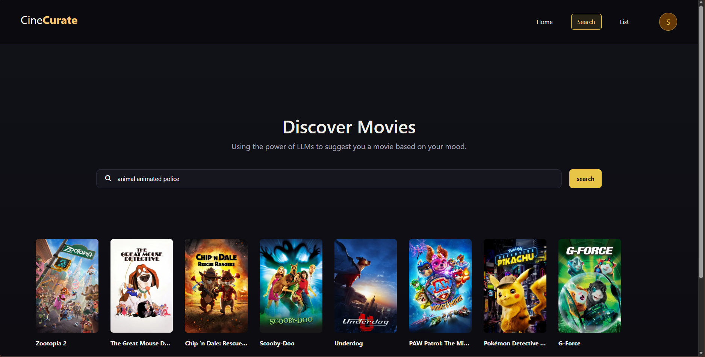
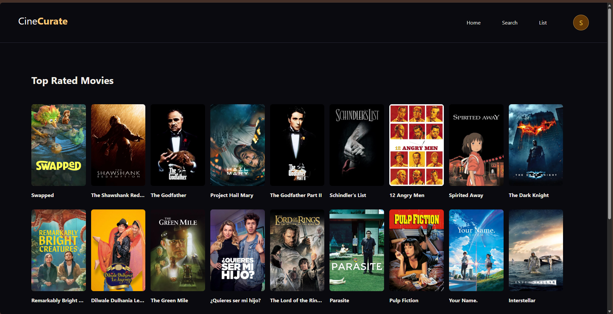
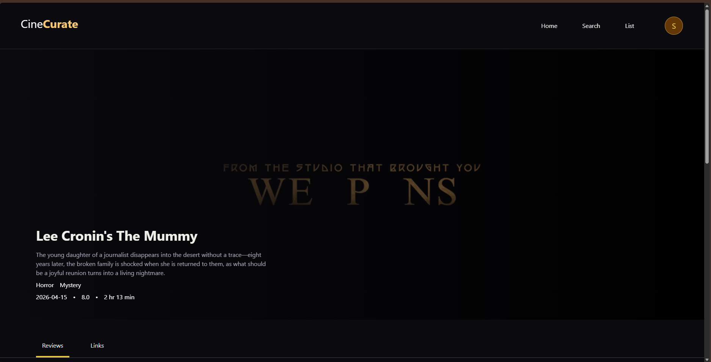

<div>
# 🎬 CineCurate
 
**Discover, explore, and curate your movie experience — powered by AI.**
 






 
[🌐 Live Demo](https://cine-curate.vercel.app/sign/in)
 
</div>
---
 
## About The Project
 
Ever been in that situation where you spend more time *looking* for a movie than actually watching one? CineCurate fixes that.
 
**CineCurate** is a movie discovery web app that pulls live data from TMDB and throws a Gemini AI layer on top of it — so instead of scrolling endlessly through categories, you can just type something like *"a mind-bending sci-fi with a sad ending"* and actually get results that make sense. It's the kind of search that feels like asking a friend who's watched everything.
 
Beyond search, it's a proper movie companion. Pick any film and you'll get the full picture — runtime, release year, audience rating, critic reviews, an embedded trailer, the official website if one exists, and a direct IMDb link. Everything you'd want before committing two hours of your life to something.
 
Under the hood, it uses Firebase for auth, Redux to keep state sane across the app, and Tailwind for the UI. The whole thing is deployed on Vercel and talks to three different APIs without breaking a sweat (most of the time).
 
---
 
## Features
 
- **Authentication** — Login and signup handled cleanly via Firebase Authentication. Your session persists across refreshes.
- **Movie Browsing** — Browse across tabs: Now Playing, Top Rated, and Upcoming — all pulling live data from TMDB.
- **AI-Powered Search** — Powered by Gemini API. Describe a movie in plain English and it figures out what you mean. Type a mood, a genre mashup, a plot fragment — it handles it.
- **Movie Detail Page** — Runtime, release year, TMDB rating, full reviews, official website link, IMDb link, and an embedded YouTube trailer. Everything in one place.
- **Trailers** — YouTube trailers embedded directly on the detail page, stripped of the YouTube logo clutter.
---
 
## 🛠️ Tech Stack
 
| Layer | Technology |
|---|---|
| Frontend | React 18, Tailwind CSS |
| State Management | Redux Toolkit |
| Authentication | Firebase Auth |
| Movie Data | TMDB API |
| AI Search | Google Gemini API |
| Deployment | Vercel |
 
---
 
## 🚀 Getting Started
 
### Prerequisites
 
- [Node.js](https://nodejs.org/) (v18 or above)
- npm or yarn
### Installation
 
1. **Clone the repository**
   ```bash
   git clone https://github.com/amanusinggit/CineCurate.git
   cd CineCurate
   ```
 
2. **Install dependencies**
   ```bash
   npm install
   ```
 
3. **Set up environment variables**
   Create a `.env` file in the root directory:
   ```env
   REACT_APP_TMDB_TOKEN=your_tmdb_token
   REACT_APP_FIREBASE_API_KEY=your_firebase_api_key
   ```
 
   > Get your keys from [TMDB](https://www.themoviedb.org/settings/api) and [Firebase Console](https://console.firebase.google.com/).
4. **Start the dev server**
   ```bash
   npm start
   ```
 
   App runs at `http://localhost:3000`.
---
 
## 📁 Project Structure
 
```
CineCurate/
├── public/
├── src/
│   ├── app/                  # Redux store setup
│   ├── Component/            # All UI components + page-level components
│   ├── Constants/            # App-wide constants
│   ├── Data/                 # Static data
│   ├── features/
│   │   └── Movies/           # Redux slices for movie state
│   ├── Firebase/             # Firebase config and init
│   ├── Hooks/                # Custom React hooks
│   └── Utility/              # Helper functions
├── .env
├── tailwind.config.js
└── package.json
```
 
---
 
## 🧠 Learnings
 
Things that weren't obvious until they were — documented as I built this:
 
- **The flex truncation problem** — To get text ellipsis inside a flex child, you need `min-w-0` on the flex child. By default, flex children size to their content, which prevents truncation from kicking in. Explicit `min-w-0` removes that constraint.
- **Conditionally running logic inside hooks without breaking Rules of Hooks** — You can't call a hook conditionally, but you *can* create a wrapper hook that always calls both hooks internally and just skips the logic via a flag. Used this pattern in `useFetchMovies`, `useFetchNowPlayingMovies`, and `useFetchTopRatedMovies`.
- **Dynamic routing + navigation state** — Used `useLocation` + `useNavigate` to change the active page based on which tab/button was clicked, and fetched data accordingly.
- **See More / See Less in reviews** — Compared `useRef.current.offsetHeight` against `window.innerHeight` to decide whether to show the toggle at all. The button only appears if the content is actually overflowing — no fake toggles.
- **`NavLink` vs `Link`** — `NavLink` gives you `isActive` and `isPending` states out of the box. Used `isActive` to style the active tab. `Link` is just navigation, nothing more.
- **Stacking context and z-index** — Adding a positive z-index to a child won't work if the child is `position: static`. Made the child `position: relative` to bring it into the stacking context, which let it sit above the background gradient without being clipped by the parent.
- **`Promise.all` for parallel API calls** — Used `Promise.all` to resolve multiple movie data fetches simultaneously instead of waiting for each one sequentially.
- **`===` vs `==`** — `===` checks value *and* type. `==` does type coercion, so `5 == "5"` is `true`. Stick to `===` unless you have a reason not to.
- **Aspect ratio needs an anchor** — `aspect-ratio` in CSS needs at least one fixed dimension (width *or* height) to work. Without it, the element collapses.
- **Redux state doesn't survive a page refresh** — The store resets on refresh unless you persist it (e.g., with `redux-persist`). Worth knowing before you wonder why user state disappears.
- **Removing a file from Git history** — Deleting a file normally doesn't remove it from commit history. Used interactive rebase (`git rebase -i`) to scrub it cleanly.
---
 
## 🙋‍♂️ Author
 
**Aman Singh**
 
[](https://github.com/amanusinggit)
 
---
 
<div align="center">
Made with ❤️ and a lot of movies.
 
⭐ Star this repo if you found it useful!
 
</div>
